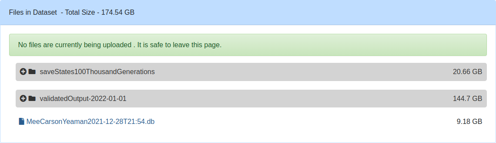

# TODO:
1. Identify all cases of absolute file paths and environment variable dependent paths.
2. Document identified paths which cannot be handled defensively.
3. & more!

---

# Directories
```
$HOME/scratch/Output
$HOME/scratch/Output/n{One,Ten}Thousand{OutputData,saveStates}
```

---

# WORKFLOW using package
1.    Download data.
2.    Load package.
3.    A list of simulation objects will be created upon `SLiMSim$paper_simulations_init()`.
4.    New simulation objects can be created by assigning `SLiMSim$new(...)` (read the package documentation) to an object such as `simulation_one`.
5.    Simulation information can be printed with `simulation_one$print()`.
6.    Simulations can be continued using `simulation_one$continue(...)` to acquire the command-line used for continuing a simulation.

------------------------------------------------------------------------

<div align="center">
<h3>Antagonistic Pleiotropy & Conditionally Deleterious Mutations</h3>
<h3>in Local Adaptation with Functional Genetic Redundancy</h3>
<h5>Bryce Carson</h5>
<h5>2022-04-30</h5>
</div>

<div align="center">
<details>
<summary>Alternate titling of _this_ repository</summary>
Explain the titling of this markdown document...
</details>
</div>
<hr> 
<details>
<summary>What is local adaptation?</summary>
<p>Local adaptation is genetic adaptation to a local environment; for the (sub-)population the term applies to (a locally adpated population), that population has its highest fitness in that location. If the population migrates to another location its fitness will be reduced. Some definitions also require that the (sub-)population have the highest fitness relative to any sample of individuals of the species that could migrate to that location.</p>
</details>

---

# About this repository
<a href="https://www.github.com/Bryce-Carson/APCD10Cr_Carson_2022">The *APCD10Cr_Carson_2022* repository</a> hosts the source code and documentation of that code used in the production of data for *The accumulation of conditionally deleterious mutational load is augmented in regions linked to adaptive loci*, a study of local adaptation using SLiM.

At the time of publication of the data to the Federated Research Data Repository (hereafter FRDR; <a href="https://www.frdr-dfdr.ca/">www.frdr-dfdr.ca</a>), the manuscript by Mee, Carson, & Yeaman describing this research is not published and is in preparation. The researchers involved in this study are listed in the table below.

## Contribution details
The title for the BioRXiv manuscript in preparation is: Mee, J.A., Carson, C., & Yeaman, S.M. (2022) *The accumulation of conditionally deleterious mutational load is augmented in regions linked to adaptive loci*.

<table>
  <caption><b>Table 1:</b> The owner of this repository, Bryce Carson, is the sole author of the source code for the source files in this repository, and the sole author of the dataset linking to this repository from the FRDR (TODO: name of dataset). Data published in the FRDR was created as a research output during the method of study for a forthcoming publication by the data author and others. When the manuscript is in a pre-print archive or officially published this repository will be updated to reflect that. If you have questions related to the data published in the FRDR or this GitHub repository contact Bryce Carson (<a href="mailto:bcars268@mtroyal.ca">bcars268@mtroyal.ca</a>).</caption>
  <tr><th>Contributor</th><th>ORCID iD</th><th>Contributor role and details</th><th>Affiliation</th></tr>
  
  <tr class="table-row">
    <td class="table-column-contributors-names">Bryce Carson</td>
    <td class="table-column-contributors-orcid-id"><a href="https://orcid.org/0000-0002-1362-2998">0000-0002-1362-2998</a></td>
    <td class="table-column-contributors-affiliations">Sole author of data and source code for multi-chromosome simulations (see details)</td>
    <td class="table-column-contributors-affiliations">Mount Royal University (Research Assistant)</td>
  </tr>

  <tr class="table-row">
    <td class="table-column-contributors-names">Jon Mee</td>
    <td class="table-column-contributors-orcid-id"><a href="https://orcid.org/0000-0003-0688-1390">0000-0003-0688-1390</a></td>
    <td class="table-column-contributors-contribution">Principle investigator</td>
    <td class="table-column-contributors-affiliation">Mount Royal University (Associate Professor)</td>
  </tr>

  <tr class="table-row">
    <td class="table-column-contributors-names">Sam Yeaman</td>
    <td class="table-column-contributors-orcid-id"><a href="https://orcid.org/0000-0002-1706-8699">0000-0002-1706-8699</a></td>
    <td class="table-column-contributors-contribution">Principle investigator</td>
    <td class="table-column-contributors-affiliation">University of Calgary (Associate Professor)</td>
  </tr>
</table>

# CONTENTS
A workflow manager was not used during data production, so several scripts were written to produce, validate, and aggregate the data. Data production, validation, and aggregation are described individually in separate sections of this README.

Summarizing the whole workflow:
1. Population genetic data is produced using SLiM 3 (Haller, Messer) with `APCD10Cr_20211222.slim` as the input model, and submitted to the scheduler using `APCD10Cr_model_20211222_job_script.sh` which depends on temporary files created by `APCD10Cr_model_generate_parameter_files.sh` and `APCD10Cr_model_20211218_parameters.tsv`. (*NOTE:* read the section to use an improved workflow, written specially for reproduction purposes.)
2. The produced data is validated with `APCD10Cr_data_validation.R`, scheduled with `APCD10Cr_data_validation_job_script.sh`, and uses an R packages lock-file `APCD10Cr_data_validation_renv.lock`.
3. Aggregation of the data is performed with `APCD10Cr_mutations_analysis.R`, scheduled with `APCD10Cr_mutations_analysis_job_script.sh`, and uses the R packages lock-file `APCD10Cr_mutations_analysis_renv.lock`.
4. Visualization of aggregated data with a Shiny application (`APCD10Cr_mutations_app.R`), with the data contained in `APCD10Cr_mutations_app_db_created_20211228.db`, and an R packages lock-file `APCD10Cr_mutations_app_renv.lock`.

<details>
<summary>File listing</summary>
<pre>
APCD10Cr_Carson_2022
.
├── APCD10Cr_alternation_of_genotypes
│   ├── genotypeTimeSeries.org
│   └── genotypeTimeSeries.org~
├── APCD10Cr_continue_sims_20211005_part_one.R
├── APCD10Cr_continue_sims_20211005_part_two.R
├── APCD10Cr_continue_sims_20211005_using_gnu_parallel.sh
├── APCD10Cr_continue_sims_20220425.Rmd
├── APCD10Cr_data_validation_job_script.sh
├── APCD10Cr_data_validation.R
├── APCD10Cr_data_validation_renv.lock
├── APCD10Cr_model_20211218_parameters.tsv
├── APCD10Cr_model_20211222_job_script.sh
├── APCD10Cr_model_20211222.slim
├── APCD10Cr_model_generate_parameter_files.sh
├── APCD10Cr_mutations_analysis_job_script.sh
├── APCD10Cr_mutations_analysis.R
├── APCD10Cr_mutations_analysis_renv.lock
├── APCD10Cr_mutations_app_db_created_20211228.db
├── APCD10Cr_mutations_app.R
├── APCD10Cr_mutations_app_renv.lock
├── APCD10Cr_sacct
│   ├── RSession?.RData
│   ├── sacct.log
│   ├── sacct.log.R
│   ├── sacct.RData
│   └── sacct.Rhistory
├── c22pkg
│   ├── c22pkg.Rproj
│   ├── DESCRIPTION
│   ├── man
│   ├── metadata.csv
│   ├── mutsFilenames_sorted.txt
│   ├── mutsFilenames.txt
│   ├── NAMESPACE
│   ├── R
│   │   └── SLiMSim.R
│   ├── README.html
│   ├── README.md
│   ├── renv
│   │   ├── activate.R
│   │   ├── settings.dcf
│   │   └── staging
│   └── renv.lock
├── COPYING.txt
├── globus.png
└── README.md

7 directories, 39 files
</pre>
</details>

<div class=warning>

> *⚠ Warning:*
>
> Use the R function `renv`, from the package of the same name, to load the lock-file for each R workflow. Lockfiles specify the packages (and versions and dependencies thereof) used in the project regardless of machine or architecture. See the vignette for renv and the talk at rstudio::conf 2020 for more information on and an introduction to renv.
 
> *⚠ Warning:*
>
> Paths and filenames were refactored to assist in reproduction. Where relevant, the variables or file-names referred to in source files have been documented. During reproduction, editing the files may still be necessary to ensure that files are found in the expected places; it is recommended to study the source files before attempting reproduction following the instructions in this repository.

</div>

---

# Data production using SLiM
**A SLiM Model**

TODO: refer to c22pkg, not generateParameterFiles.sh, and write as if I wrote an R package, but do not make it a necessity.

The SLiM model is not particularly complex, but the supporting work files may be challenging. There are three use cases: running new simulations; continuing simulations; increasing the output frequency for existing simulations.

<details>
<summary>New simulations</summary>
The first use–case takes fewer command–line arguments than the others, it simply `--define`s the parameters of the simulation (e.g. `R=1e-8`). The command–line is generated from a BASH script that depends on a SLURM environment variable, `$SLURM_ARRAY_JOB_ID`, which will control which parameter file is read by `xargs` and used to define the simulation parameters.

Parameters are generated from a tsv file. See the `parameterSet-2021-12-18.txt` file for an example.

<div class="warning">

> *⚠ Warning*
>
> The SLiM model outputs the entire model state for save files in the same event block as the custom output is generated. This was written mostly in 2019, and as such was not changed. The implication of output being at the beginning of a generation or the end was discussed and deemed not an important distinction when the frequency of output is every five thousand generations.
> 
> This creates the following warning, but can be (and was) ignored:
>
> > `#WARNING (SLiMSim::ExecuteMethod_outputFull): outputFull() should probably not be called from an early() event in a WF model; the output will reflect state at the beginning of the generation, not the end.`

</div>

### Creating New Simulations

The first case takes fewer command-line arguments than the others, it simply `--define`s the parameters of the simulation (e.g. `R=1e-8`). The command-line is generated from a BASH script that depends on a SLURM environment variable, `$SLURM_ARRAY_JOB_ID`, which will control which parameter file is read by `xargs` and used to define the simulation parameters.

Parameters are generated from a plaintext file originally created with `paste`. See the `parameterSet-2021-12-18.txt` file for an example. This was written before I knew R, and when I was still learning Eidos to create the SLiM model (in the afar ago year of 2019).

```{bash eval=FALSE}
cat > R
R
1e-7
^D
cat > muAP
muAP
1e-4
^D
# and so forth
paste R muAP N m phi muCD sAP r sCD outputEveryNGenerations
```


```{bash}
cat SLiM/parameterSet-2021-12-18.tsv
```

For the *reader's* convenience, an R script was written for your use.
```{r eval=FALSE}
library(tidyverse)
library(glue)

parameters <- list(
  R = 1e-7,
  muAP = 1e-4,
  N = c(1000, 10000),
  m = 0.001,
  phi = 0.5,
  muCD = 1e-8,
  sAPValue = c(0.0625, 0.0833, 0.1, 0.1666, 0.25, 0.5),
  r = 0.000001,
  sCD = -0.001,
  outputEveryNGenerations = 5000
) %>%
  expand.grid() %>%
  as_tibble()

glue_data(
  .sep = "\n",
  .x = parameters,
  "-d R={R}",
  "-d muAP={muAP}",
  "-d N={N}",
  "-d m={m}",
  "-d phi={phi}",
  "-d muCD={muCD}",
  "-d sAPValue={sAPValue}",
  "-d r={r}",
  "-d sCD={sCD}",
  "-d outputEveryNGenerations={outputEveryNGenerations}"
) %>%
  str_split(pattern = "\n") %>%
  map2(.x = .,
       .y = paste0("params_", 1:12),
       ~ write_lines(x = .x, file = .y))

if(!system("command -v sbatch")) {
  system2(
    command = "sbatch",
    input = c(
      "#!/bin/bash",
      "#SBATCH --array=1-12",
      "#SBATCH --time=06-12:00:00",
      "#SBATCH --mem-per-cpu=9G",
      "#SBATCH --ntasks=1",
      "#SBATCH --no-kill",
      '#SBATCH --job-name="APCD10Cr_EXAMPLE"',
      "#SBATCH --mail-type=TIME_LIMIT_90,ARRAY_TASKS,FAIL",
      "#SBATCH --mail-user=user@example.com",
      "slim -m -l `xargs -a params_${SLURM_ARRAY_TASK_ID}` APCD10Cr-2021-12-22.slim",
      "# To have replicates, this job should merely be submitted ten times for ease."
    )
  )
} else { stop("sbatch was not found on the path.") }

system2("rm", args = paste0("params_", 1:12))
```

</details>

<details>
<summary>Continuing simulations</summary>
The second case is implemented with command-line arguments to SLiM defining constants which specify the random seed, the output directory where save states can be found, and the output directory where mutation and individual fitness output files can be found.

<div class="warning">

> *⚠ Warning:*
>
> The continueSimulations directory contains the scripts that were used to complete a small number of simulations that had corrupted output at later stages due to filesystem-io errors. The scripting for continuing simulations that failed due to memory or time constraints on the computing clusters were ad-hoc and used the logging from SLiM (`-l`), BASH, and some `grep`ing to collect together the necessary information: what simulations failed?; what are the parameters of the failed simulations?; where are the output files?; etc. With that information simulations were completed in that situation. The former situation, filesystem-io errors, needed a different solution because the last output generation could not be assured to be completely-output, so the last generation was deleted from the output file and the previous generation save state loaded to resimulate the generations preceeding the error and until completion.
>
> This does not impact the normal flow of continuing simulations.

</div>

Refer to the documentation under the [continueSimulations/](#continuesimulations) heading to learn about that workflow.
</details>

<details>
<summary>Changing output frequency</summary>
The third case was not actually used, but is generally implemented in the SLiM workflow by taking command-line arguments to continue simulations and also to specify the output frequency. This allows a user of the model to increase the frequency of output from 5,000 generations per output to a higher frequency to gain more insight into the population genetic dynamics during a period of time in the local adaptation of the populations.

 - Modify the SLiM command-line argument `-d outputEveryNGenerations=5000`, adjusting the integer, to change the frequency of output.
</details>

The version of SLiM that was used to generate the output on Compute Canada clusters is given below.

> <div class="justgivemeindentation"><pre><font color="#2AA1B3"><b>~/bin</b></font> <font color="#26A269"><b>❯</b></font> slim -v<br>SLiM version 3.3.2, built May 4 2020 19:43:23</pre></div>

<div class="oxford-citation-text">
<p>Benjamin C Haller, Philipp W Messer,  SLiM 3: Forward Genetic Simulations Beyond the Wright–Fisher Model, <em>Molecular Biology and Evolution</em>, Volume 36, Issue 3, March 2019, Pages 632–637, <a href="https://doi.org/10.1093/molbev/msy228" data-google-interstitial="false">https://doi.org/10.1093/molbev/msy228</a></p>
</div>

# dataValidation/
The mutation output files for every simulation included in the SQLite database and usable with the Shiny application were validated using the `assertr` and Appsilon `data.validator` packages.

An HTML report was not generated for the full breadth of output, but was toyed with. The actual method used to monitor for file corruption or incompletion was the tryCatchLog dump, a log file, the Rout, and simple stderr or SLURM facilities.

# RSQLite/
The database contains the analyzed information and metadata of the mutation output files. The metadata uniquely specifies the ten replicates which compose a parameter set.

The heatmaps and sojourn density data are included in the database, and are retrieved from it by the Shiny application for visualization and study.

The SQLite database is stored in the Federated Research Data Repository (FRDR) along with the raw data from the research project this (GitHub) repository belongs to.

> When the FRDR submission is approved, this repository will be updated with a link to it.

1. `MeeCarsonYeaman2021.sh` copies `*out_Muts.txt` files from a scratch directory to node-local SSD storage and calls the R script after loading the R module in the compute environment.
2. <code id="meecarsonyeaman2021">MeeCarsonYeaman2021.R</code> performs the analytical work on the mutations, such as estimating population statistics and stores this information in an SQLite database.

# Shiny/ 
The application does not at this time include support for exporting the R objects it accesses from the SQLite database or downloading the plots it generates from those objects.

As of 2022-01-06 the method for accessing the data outside of the Shiny application is through using the functions in the [`MeeCarsonYeaman2021.R`](#rsqlite) script in an interactive R session.

## continueSimulations/
### Pseudocode
1. Infer the name of the saveStates and find the last two for each simulation that needs to be completed.
2. Find the location of the indFitness.txt file as well, and relocate it to be alongside the out_Muts.txt files in the `~/scratch/Output/unfinishedOutput/` directory.
3. Build a command-line that will call `slim` with all of the necessary `-d[efine]` arguments to resume the simulation. This includes:
  - a `-d` for each parameter key-value pair (e.g. `-d R=1e-07`).
  - a `-d slurmSimulationStateFile=FILE` argument, where FILE is the second-last save state file.
  - a `-s seed` argument to restore the exact pseudo-random trajectory of the simulation.
  - a `-d outputMutationsFile=FILE` argument.
  - a `-d outputIndFitnessFile=FILE` argument.

  NOTE: this step requires modifying the SLiM model to include a condition that will set the path for the two calls of `writeFile()` and the call of `outputFull()` to the paths specified on the command-line.

4. Create a backup of the files that will be worked on, just in case of a progammer error. "Only human."
5. Delete the last (most recent) save state file, and trim that generation's output from the indFitness and out_Muts output files.
6. Call asynchronous processes for each command-line built and finish the simulations.

### From old Rmd
To continue a simulation from a save state, add the "outputMutationsFile", "outputIndFitnessFile", "saveStateDirectory", and "saveStateFilename" definitions (`-d[efine]`s) and `-s` (seed) to the glue that makes the command lines.

```{r eval=FALSE}
glue_data(
  .sep = "\n",
  .x = parameters,
  "-d R={R}",
  "-d muAP={muAP}",
  "-d N={N}",
  "-d m={m}",
  "-d phi={phi}",
  "-d muCD={muCD}",
  "-d sAPValue={sAPValue}",
  "-d r={r}",
  "-d sCD={sCD}",
  "-d outputEveryNGenerations={outputEveryNGenerations}",
  "-d outputMutationsFile='validatedOutput-2022-01-01/APCD10Cr_R=1e-07_r=0.000001_muAP=0.0001_N=10000_m=0.001_phi=0.1_sCD=-0.0005_muCD=1e-08_sAP=000_Replicate=0_1698402343150_out_Muts.txt'",
  "-d outputIndFitnessFile='validatedOutput-2022-01-01/APCD10Cr_R=1e-07_r=0.000001_muAP=0.0001_N=10000_m=0.001_phi=0.1_sCD=-0.0005_muCD=1e-08_sAP=000_Replicate=0_1698402343150_out_indFitness.txt'",
  "-d saveStateDirectory='./saveStates100ThousandGenerations'",
  "-d saveStateFilename='./saveStates100ThousandGenerations/APCD10Cr_R=1e-07_r=0.000001_muAP=0.0001_N=10000_m=0.001_phi=0.1_sCD=-0.0005_muCD=1e-08_sAP=000_Replicate=0_1698402343150_outputFull_Generation=100000.txt'",
  "-s 1698402343150"
) %>%
  str_split(pattern = "\n") %>%
  map2(.x = .,
       .y = paste0("params_", 1:12),
       ~ write_lines(x = .x, file = .y))
```

# Data publication (archival)
The research data produced by the code in this repository is archived in the FRDR under the dataset title *TODO: new title*.

<div align="center">


</div>

These are the files published in the FRDR dataset: TODO: name of data publication. Link: TODO.



# Funding
We acknowledge the support of the Natural Sciences and Engineering Research Council of Canada (NSERC).

Nous remercions le Conseil de recherches en sciences naturelles et en génie du Canada (CRSNG) de son soutien.

<div align="center">


</div>
